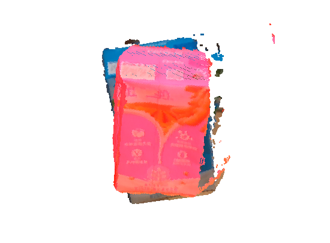
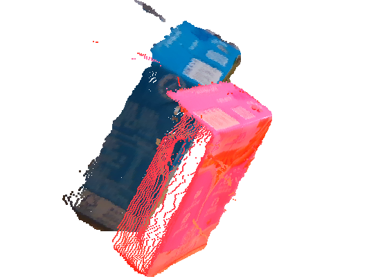
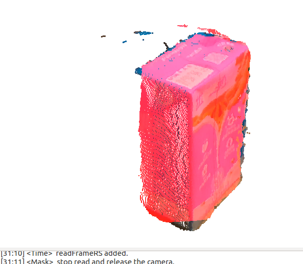
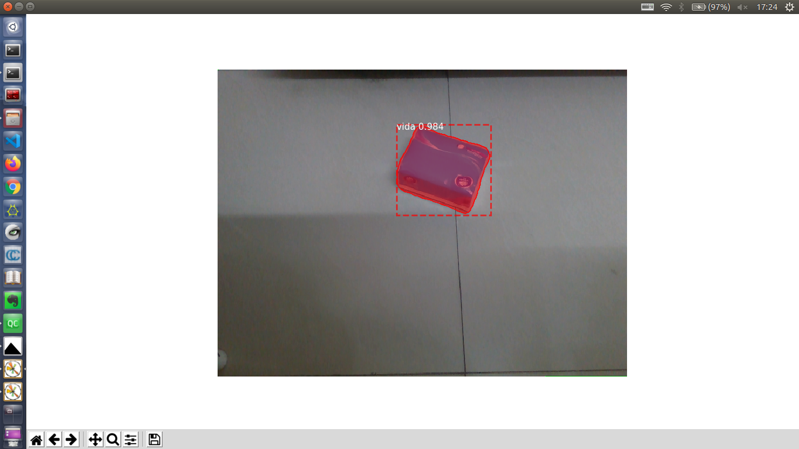
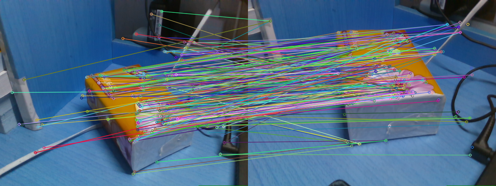
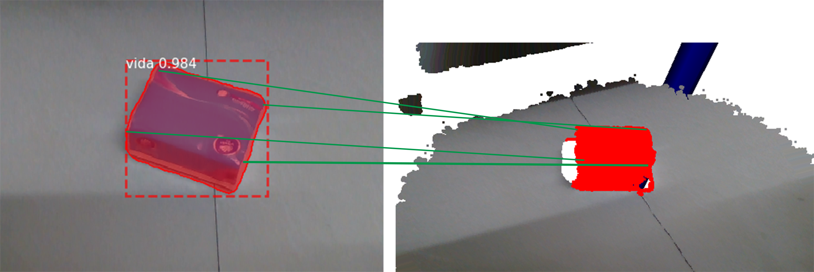
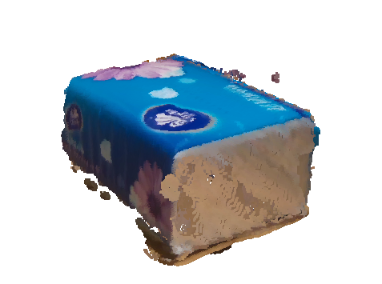
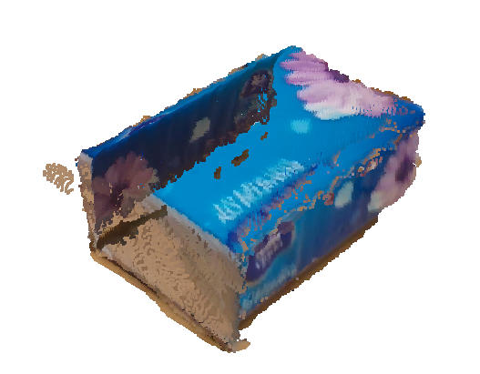
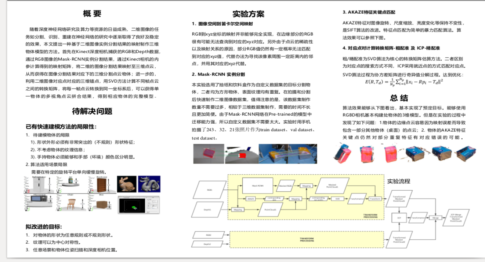
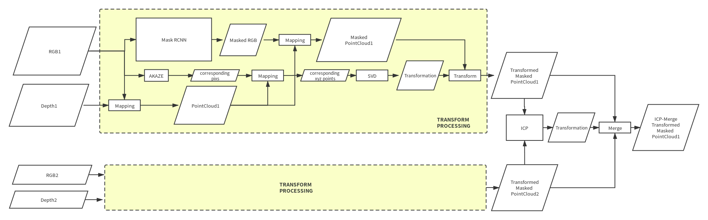

# Quickly_Transform_Dataset_from_2D_to_3D
this is a Method ransform_dataset_from_2D_to_3D. As we have an excellent segmetation outcome in 2D image, it can be helpful to create 3D dataset easily. 

## baisc steps
* capture 2D and depth images using a RGBD camera.
* segmentation 2D images using well known DNN like Mask-RCNN.
* mapping the masked 2D images (got from step 2) to the depth data, using the camera params.
* extract 3D masked poinclouds and object classes using 2D images segmentation result.
* remove the outlier of the classified pointclouds using distance principle.
* save the classified poinclouds segmentation result.

## feature 
The presicion of this method basicly depends on the 2D segmentaion result. So in simple scene its performance is excellent.
For detailed visual results, you can browse another [repository](https://github.com/wangzivector/object_detection-Qt-PCL-ROS-GUI)

## result

### segmentation and matched points

 

### SVD transformation and ICP 

 

### Final model

## description post

